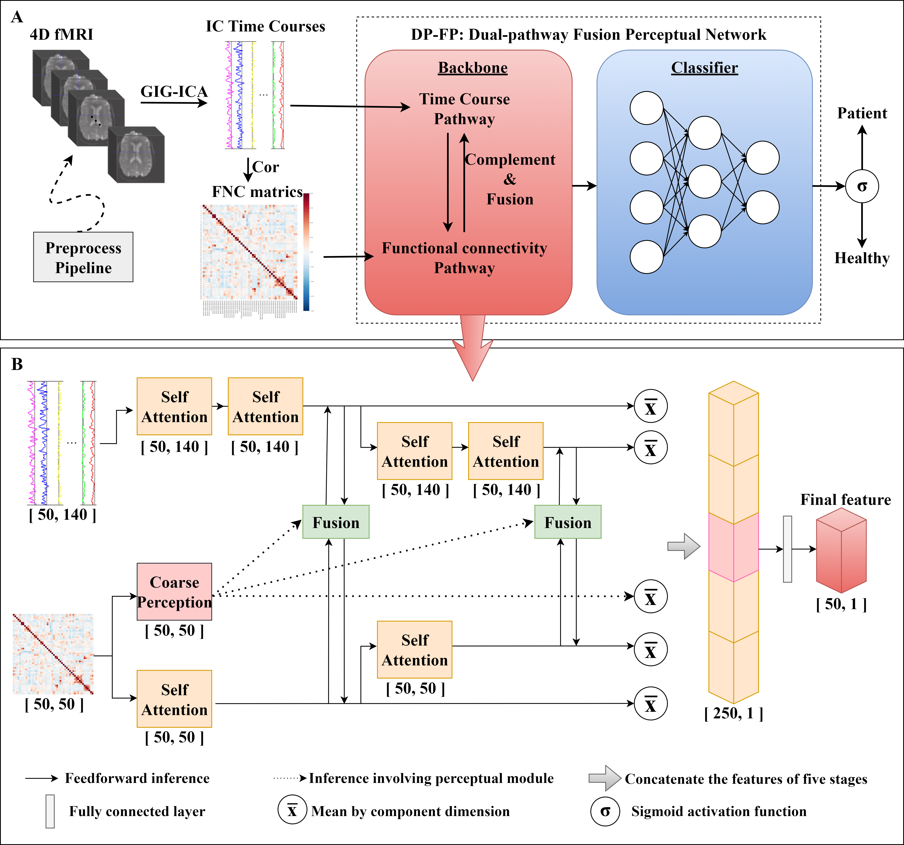
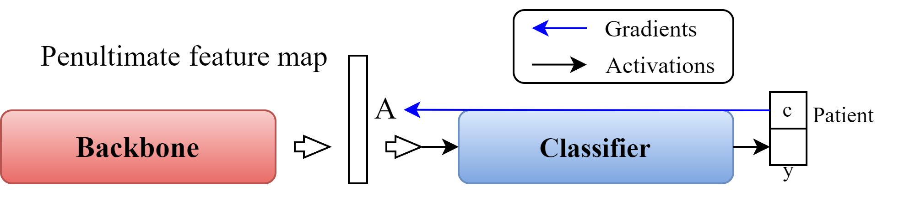

# DP-FP
Bimodality Approach to Mental Disorder Diagnosis via Dual-pathway Fusion Perceptual Network

## Catalogues
1. [Introduction](##Introduction)
2. [Requirements](##Requirements)
3. [Datas](##Datas)
4. [How to use](##How to use)
5. [Contact Us](##Contact Us)
6. [许可证](##许可证)
7. [联系信息](##联系信息)

## Introduction
We proposed a dual-pathway fusion perceptual (DP-FP) network that leverages multi-stage attentional perception, effectively distin guishing psychiatric disorder patients from healthy controls. 
Specifically, DP-FP consists of two pathways to receive time course and functional connection inputs respectively. 
Self-attention modules were introduced into the network structure, which not only enhance the capability of fine-grained feature extraction, but also improve the interpretability of model. 
Furthermore, a coarse perception module and a fusion strategy were proposed, which achieved deep integration of feature representations from the two pathways and optimized the complementarity of information.



## Requirements
To run this code, you need the following dependencies:
- Python==3.7
- PyTorch==1.10.1
- matplotlib==3.5.3
- nibabel==3.2.2
- nibabel==4.0.2
- nilearn==0.10.0
- numpy==1.21.6
- prettytable==3.11.0
- scikit_learn==1.0.2
- scipy==1.7.3
- tqdm==4.64.0

Also, you can install the required packages by running the following command:
```
pip install -r requirements.txt
```

## Datas

We used three datasets: the SZ dataset, which is derived from the Center of Biomedical Research Excellence (COBRE), the ASD dataset, which is derived from the Autism Brain Imaging Data Exchange (ABIDE), and the Attention 
Deficit Hyperactivity Disorder (ADHD) dataset, which is derived from the ADHD-200 Sample.
You can download the datasets from the following links:
[ABIDE Preprocessed](http://preprocessed-connectomes-project.org/abide/),
[ABIDE1](https://fcon_1000.projects.nitrc.org/indi/abide/abide_I.html),
[COBRE](https://fcon_1000.projects.nitrc.org/indi/retro/cobre.html),
[ADHD](https://fcon_1000.projects.nitrc.org/indi/adhd200/).

If you download data that is not pre-processed, you will need to pre-process it yourself. The pre-processing and post-processing processes are described in the paper.

Here we provide two of the data we processed for your testing convenience. (in ./datas/)

## How to use
### Train:
1. Download the data and put it in the ./datas/ directory.
2. Modify the file path and parameter configuration in the train.py file.
3. Run the following command to train the model:
```
python train.py
```
### Viaualization:

File weight_inverse_mapping.py is used to generate the weight inverse mapping of the model, which can be used to visualize the attention map of the model.



If you want to use the weight inverse mapping, you can flow the following steps:

1. Add the _mean_component_ica_s_all_.nii file (generated by the GIFT toolbox when you doing GIG-ICA) to the ./datas/ directory.
2. Modify the file path and parameter configuration in the weight_inverse_mapping.py file.
3. Run the following command to generate the weight inverse mapping:
```
python weight_inverse_mapping.py
```
And then, you will get the weight inverse mapping brain file in the ./results/ directory. You can use the nilearn package or Brain viewer toolbox to visualize the brain file.

## Contact Us

If you have any questions, please feel free to contact us by email: [email](mailto:xuruipeng@mail.ustc.edu.cn)

